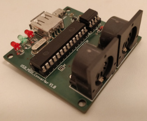
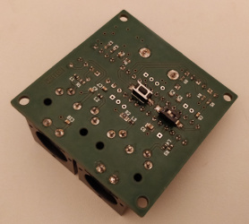

# midi-converter
 

Standard MIDI to USB MIDI converter. This converter switches automatically between USB host and USB device based on the USB connection. Connection to to USB port of the PC starts USB device mode, while connection to a keyboard equipped with USB MIDI port will force it to switch to USB host mode. This converter also contains USB boot loader which makes update of the new firmware very easy. Update can be done via USB stick.

**Folders contain the following information:**
- src - source code of the converter and boot loader
- geda - schematics and pcb files

This is just inital version of readme file. All the details and instructions how to use it will be added soon.

## Table of Contents
* [Source code](#source-code)
* [Hardware](#hardware)

### Source code
Source code description will come here

### Hardware
Description of schematics and PCB will come here
